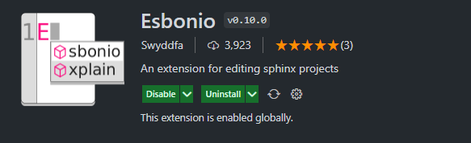
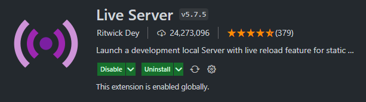
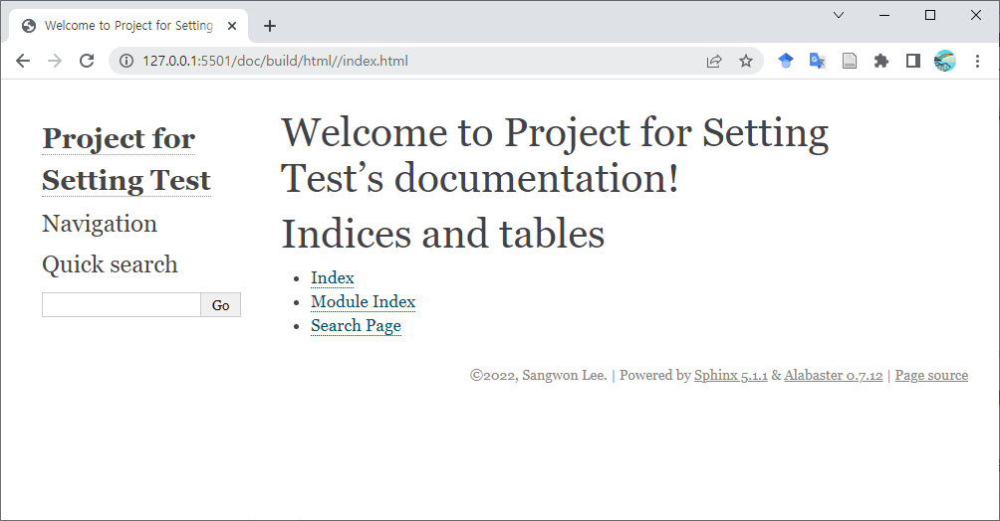
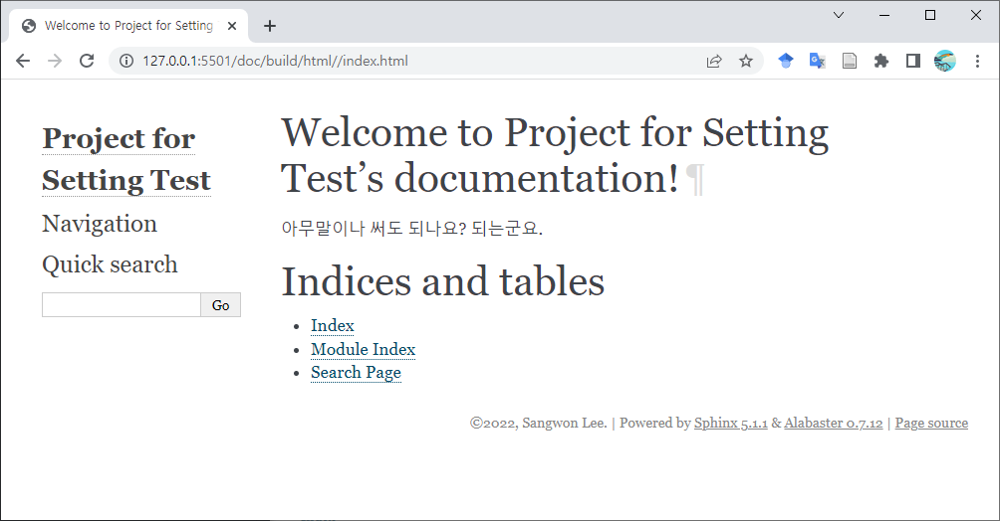

===========
Sphinx 설치
===========

파이썬 설정
===========

Sphinx 역시 파이썬 라이브러리이고 프로젝트마다 다른 추가 설치를 요구하기 때문에 
다른 라이브러리와 같이 가상환경으로 사용하도록 하겠습니다. 초심자의 경우 실시간으로
변경 사항을 확인하며 작성해야 하기 때문에 VSCode 확장을 사용하여 프리뷰를 
사용하도록 설명하겠습니다. 

먼저 가상 환경을 다음과 같이 생성합니다.

.. code-block:: 

    python -m venv sphinx-env

여기서 ``sphinx-env`` 의 경우 본인이 원하는 이름을 사용해도 됩니다. 또한 Conda 등을
사용하여 환경을 생성해도 상관없습니다.

파이썬 가상환경 설정이 완료되었으면 **해당 가상환경** 에서 다음과 같은 Sphinx와 관련
라이브러리를 설치합니다.

.. code-block::

    pip install sphinx

.. warning:: 

    생성한 가상 환경에서 설치하는지 반드시 확인하세요.

VSCode 설정
===========

작성시 효율을 높히기 위하여 변경 사항을 실시간으로
볼 수 있는 preview 기능이 필요합니다.
VSCode와 extension을 사용하면 프리뷰 기능을 사용할 수 있습니다.

Esbonio 설정
-----------------

우선 파이썬 가상환경에 ``esbonio`` 를 설치합니다.

.. code-block::

    pip install esbonio

VSCode extension 탭에서 ``Esbonio`` extension을 설치합니다.

다음 설정을 위해서는 VSCode 프로젝트가 필요합니다.
아래의 설정은 문서 프로젝트를 새로 만들 때마다 해줘야 합니다.
아래와 같이 프로젝트를 생성한 뒤 터미널을 실행하고 기본 시스템 환경에서 
``shpinx-quickstart`` 를 실행합니다. 

.. code-block:: 

    sphinx-quickstart doc

.. note:: 

    명령어 뒤의 doc은 ``doc`` 폴더에 문서 기본 파일들을 생성하겠다는 의미입니다.

몇가지 질문을 하는데 적당히 입력합니다.

::

    > Separate source and build directories (y/n) [n]: y
    > Project name: Project for Setting Test
    > Author name(s): Sangwon Lee
    > Project release []: 
    > Project language [en]:

위의 과정이 완료되면 ``doc`` 경로에 기본 문서 파일이 생성됩니다.
다음과 같이 ``doc/`` 폴더에서 ``make html`` 을 입력하면 
``doc/build/html/index.html`` 라는 파일이 생성됩니다.
웹브라우저를 사용하여 실행하면 다음과 같습니다.

.. figure:: _static/dpage.png

이렇게 작성한 뒤 ``make`` 를 사용하여 확인할 수도 있지만 위에서 언급한 것과 같이
실시간으로 확인하는 것이 더 효율적입니다.

실시간 프리뷰를 위하여 프로젝트 설정 파일인 ``.vscode/settings.json`` 의 내용에
다음과 같은 항목을 추가합니다.

.. code-block:: json

    {
        "esbonio.sphinx.buildDir" : "${workspaceFolder}/doc/build",
        "esbonio.sphinx.confDir"  : "${workspaceFolder}/doc/source",
        "esbonio.sphinx.srcDir"   : "${workspaceFolder}/doc/source",
        "esbonio.server.enabled": true,
        "esbonio.server.pythonPath": "${workspaceFolder}/sphinx-env/Scripts/python.exe",
        "esbonio.server.logLevel": "debug",
    }

만약 나중에 ``doc`` 이 아닌 다른 경로를 사용하신다면 그에 맞게 수정하면 됩니다. 또한
본인의 가상환경 이름이 ``sphinx-env`` 가 아니라면 그 또한 맞는 파이썬 경로로 수정하면 
됩니다.

.. note:: 

    만약 리눅스에서 venv를 사용하여 가상환경을 생성했다면 
    ``"esbonio.server.pythonPath": "${workspaceFolder}/sphinx-env/bin/python"``
    의 값이 사용됩니다. 이처럼 OS와 가상환경 생성방법 등의 영향을 받기 때문에
    주의해야 합니다.

Live Server 설정
-------------------

다음으로 ``Live Server`` 를 설치합니다. 기본적으로 VSCode를 내부에서 프리뷰 기능을
사용할 수도 있지만 불안정한 경우가 있어서 ``Live Server`` 를 활용하는 방향으로
정하였습니다.

위의 과정을 완료한 뒤 오른쪽 하단의 |button| 를 클릭하여 서버를 실행하면 웹브라우저가
자동으로 열리고 ``http://127.0.0.1:5500/doc/build/html/index.html`` 주소에서
다음과 같은 화면을 확인할 수 있습니다.

.. note:: 

    포트는 기본이 5500이지만 만약 해당 포트가 사용중이라면
    다른 포트 번호가 사용됩니다.

``doc/source/index.rst`` 에서 원하는 문장을 작성한 뒤 저장하면 웹 브라우저의 화면도
업데이트 됩니다.

.. code-block:: rst

    Welcome to Project for Setting Test's documentation!
    ====================================================

    .. toctree::
       :maxdepth: 2
       :caption: Contents:

    아무말이나 써도 되나요? 되는군요.

    Indices and tables
    ==================

    * :ref:`genindex`
    * :ref:`modindex`
    * :ref:`search`

이러한 프리뷰의 작동 원리는 다음과 같습니다.

   1. ``rst`` 파일을 수정하면 ``esbonio`` 서버에서 변화를 감지하고 새로운
      html 을 생성 (``sphinx`` 기능을 사용하여).
   2. ``Live Server`` 서버가 html 파일 변화를 감지하여 업데이트.

위와 같은 원리로 변경 사항을 실시간으로 확인할 수 있습니다. 단점으로는 
어떠한 이유인지 모르겠지만 업데이트 할 때 스크롤이 맨 위로 가는 경우가 있습니다.

테마 설정
============

테마를 변경할 수 있습니다. 적용하려면 우선 원하는 테마를 설치합니다.

.. code-block:: 

    pip install sphinx_rtd_theme

그 다음 ``doc/source/conf.py`` 에서 다음과 같이 라인을 추가합니다.

.. code-block:: python

    html_theme = 'sphinx_rtd_theme'

그 다음 ``esbonio`` 서버를 재시작 하면 다음과 같이 좀 더 읽기 좋은 테마가 적용됩니다.

.. figure:: _static/pview_3.png

.. note::

    뭔가 작동을 잘 안 한다면 재시작하세요. 프리뷰가 생각보다 불안정해서
    저도 뭐가 무슨 문제인지 정확히 파악하기 어렵습니다. 혹은 ``doc`` 폴더에서 
    ``make clean`` 을 수행하세요.