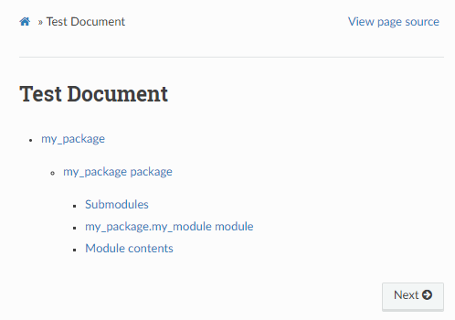
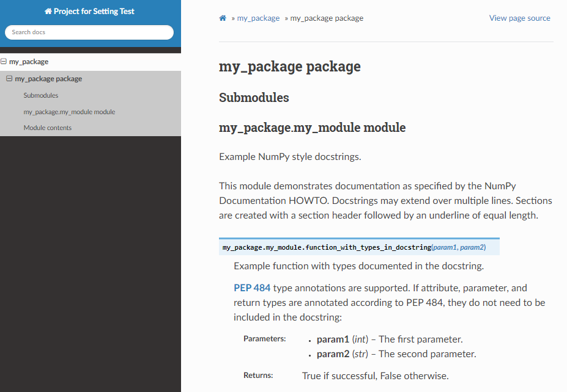

``autodoc`` 작동 테스트
==============================

프로젝트 ``root`` 폴더의 ``my_package/my_module.py`` 에 다음과 같이 작성합니다.

.. code-block:: 

    """Example NumPy style docstrings.

    This module demonstrates documentation as specified by the NumPy
    Documentation HOWTO. Docstrings may extend over multiple lines. Sections
    are created with a section header followed by an underline of equal length.
    """

    def function_with_types_in_docstring(param1, param2):
        """Example function with types documented in the docstring.

        :pep:`484` type annotations are supported. If attribute, parameter, and
        return types are annotated according to PEP 484, they do not need to
        be included in the docstring:

        Parameters
        ----------
        param1 : int
            The first parameter.
        param2 : str
            The second parameter.

        Returns
        -------
        bool
            True if successful, False otherwise.
        """

그 뒤 프로젝트 ``root`` 폴더로 이동하여 다음과 같은 명령어를 실행합니다
::

    sphinx-apidoc -f -o doc/source my_package

``my_package`` 를 자동 해석하여 작성한 ``rst`` 파일을 ``doc/source`` 에
저장하라는 명령어입니다.

다음 ``doc/index.rst`` 에 다음과 같이 생성된 모듈 ``rst`` 를 ``toctree`` 로 로드
합니다.

.. code-block:: rst

    Test Document
    =============

    .. toctree:: 

        modules

그럼 다음과 같은 화면을 ``index.rst`` 의 프리뷰에서 확인할 수 있습니다

자동으로 생성된 ``my_module.rst`` 의 프리뷰에서는 다음과 같은 익숙한 문서화
페이지를 확인할 수 있습니다.

.. tip:: 

    가끔 프리뷰가 잘 작동하지 않는 경우 해볼 수 있는 선택지:

    1. VSCode의 ``esbonio`` 서버를 재시작 한다.

    2. 
       ``make clean`` 으로 이미 생성된 html을 다 삭제하고 다시 ``make html``
       을 실행한다.

    3. ``sphinx-apidoc -f -o doc/source my_package`` 를 다시 해본다.

    프리뷰 기능이 안정적인 확장은 아니라 가끔 이상하니 주의하시기 바랍니다.

