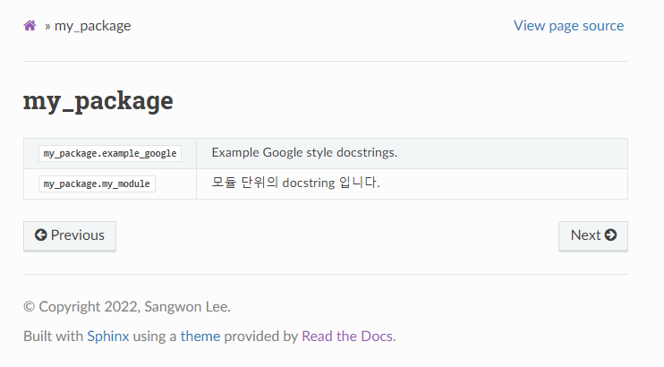
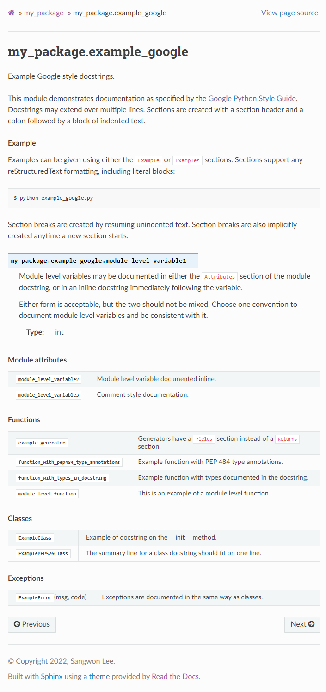

``sphinx.ext.autosummary`` 사용법
==========================================

.. toctree::

    installation
    test_run

``sphinx.ext.autodoc`` 은 모듈별 분할이 되어있긴 하지만 한 모듈 안에서는 모든
기능들이 한 페이지에 나열되게 됩니다. 모듈이 커질수록 이러한 포멧은 모듈의 파악을
어렵게 만듭니다. 이러한 문제를 해결하기 위한 Sphinx extension이
``sphinx.ext.autosummary`` 입니다.

``sphinx.ext.autosummary`` 사용하여 작성한 문서는 다음과 같은 구조를 가집니다.

메인 페이지:

``my_package.example_google`` 클릭하여 진입 시:

위에 보이는 것과 같이. 모듈별 테이블이 생성되며 해당 테이블에 접근하면 계층적으로
하위 모듈의 페이지가 생성됨을 알 수 있습니다. 해당 페이지는 모듈 설명,
``Module attributes``, ``Functions``, ``Classes``, ``Exceptions`` 로 구성되어
있습니다. 이러한 페이지의 포멧은 커스터마이징도 가능합니다.

.. attention::

    ``sphinx.ext.autosummary`` 와 ``sphinx.ext.autodoc`` 은 동시에 사용하지
    않습니다. 만약 ``sphinx.ext.autosummary`` 를 사용한다면 ``sphinx-apidoc``
    없이도 필요한 ``rst`` 파일은 자동으로 생성됩니다.
    하지만 ``sphinx.ext.autodoc`` extension에 등록해야하긴 합니다.