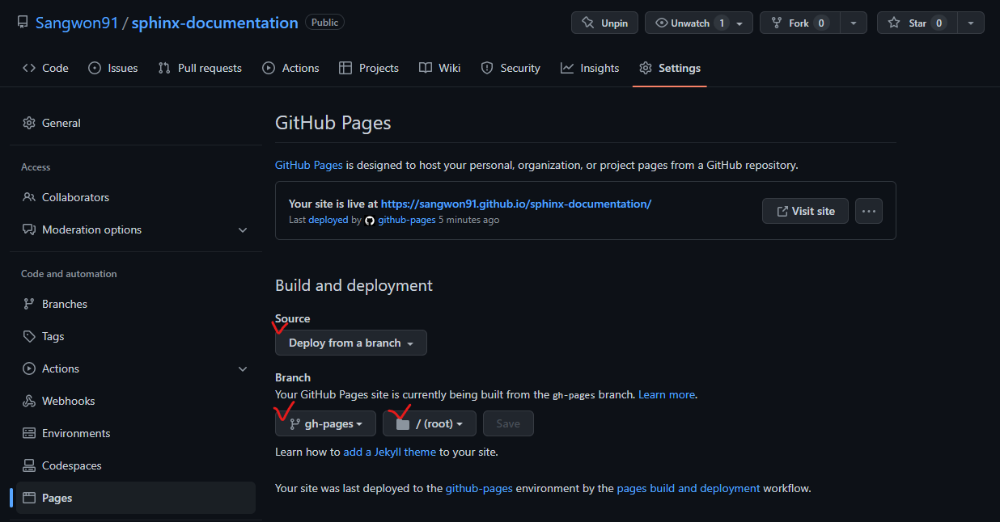

======================================================
Github Actions를 사용하여 Github Pages에 업로드 하기
======================================================

Sphinx 문서를 완성했다면 이를 사용자가 쉽게 볼 수 있도록 서빙해야 합니다. 문서의
버전이 바뀔 때마다 수작업으로 업로드 할 수 있지만 깃허브에 Push를 할 때마다 자동으로
빌드되고 서비스까지 된다면 번거로움과 에러가 발생할 가능성을 줄일 수 있습니다.

1. Github 설정하기
======================

우선 깃허브가 자동으로 Github Pages를 생성하도록 설정해야 합니다. 자신의 저장소로
이동한 뒤 다음과 같은 상태로 세팅합니다. 여기서 중요한 점은 v 체크한 부분을 같게
설정해야 합니다. Branch 정보는 Github Action 세팅을 할 때 사용됩니다.

2. Github Action 설정하기
=============================

다음과 같은 기능을 수행하는 Github Action 설정파일을 작성해야 합니다.

1. OS를 선택하여 실행한다.
2. 문서 저장소를 클론한다.
3. 적절한 파이썬 버전을 설치한다.
4. 필요한 라이브러리를 설치한다.
5. Sphinx 문서를 빌드한다.
6. 빌드한 문서 폴더를 ``gh-pages`` 브런치에 ``/`` 경로에 복사한다.

이러한 과정을 거치면 깃허브에서 설정한 세팅에 의하여 ``gh-pages`` 브런치의 변화를
감지하고 우리의 Github Pages에 업데이트된 문서가 올라가게 됩니다.

이러한 워크플로우 설정 파일은 ``.github/workflows/`` 폴더에 저장해야 하며 우리의 경우
편의상 ``.github/workflows/gh-pages.yml`` 의 이름을 사용하겠습니다.

전체 ``gh-pages.yml`` 파일의 내용은 다음과 같습니다.

.. code-block:: yaml

    # This is a basic workflow to help you get started with Actions
    name: Build and Publish Documentation

    # Controls when the workflow will run
    on:
      # Triggers the workflow on push or pull request events but only for the "main" branch
      push:
        branches: [ "main" ]
      pull_request:
        branches: [ "main" ]

      # Allows you to run this workflow manually from the Actions tab
      workflow_dispatch:

    jobs:
      ci:
        strategy:
          fail-fast: false
          matrix:
            python-version: ["3.9"]
            poetry-version: ["1.3.1"]
            os: [ubuntu-22.04]
        runs-on: ${{ matrix.os }}
        steps:
          - uses: actions/checkout@v3
          - uses: actions/setup-python@v4
            with:
              python-version: ${{ matrix.python-version }}
          - name: Install poetry.
            # It just installs the poetry.
            uses: abatilo/actions-poetry@v2
            with:
              poetry-version: ${{ matrix.poetry-version }}
          - name: Install libraries using poetry.
            run: |
              poetry install
          - name: Build documentation
            # We cannot use `poetry shell` as it's not an interactive environment.
            # But you can run following command:
            # poetry run sphinx-build -M html doc/source doc/build
            run: |
              source $(poetry env info --path)/bin/activate
              sphinx-build -M html doc/source doc/build
          - name: Publish to Github Pages
            uses: peaceiris/actions-gh-pages@v3
            with:
              # I don't it is necessary.
              publish_branch: gh-pages
              github_token: ${{ secrets.GITHUB_TOKEN }}
              publish_dir: doc/build/html
              # I don't it is necessary.
              force_orphan: true

다음은 라인별 설명입니다.

.. code-block:: yaml
    :linenos:

    # This is a basic workflow to help you get started with Actions
    name: Build and Publish Documentation

    # Controls when the workflow will run
    on:
      # Triggers the workflow on push or pull request events but only for the "main" branch
      push:
        branches: [ "main" ]
      pull_request:
        branches: [ "main" ]

      # Allows you to run this workflow manually from the Actions tab
      workflow_dispatch:

* ``2``: 위 설정은 Github Action의 이름을 설정합니다.
* ``5-13``: 이 Action이 언제 실행될 것인지에 대한 설정입니다. ``main`` 브렌치에
  대한 push나 pull request 발생시 실행됩니다. 또한 ``workflow_dispatch`` 를
  설정함으로써 Github 웹페이지에서 직접 실행할 수 있게 합니다.

.. code-block:: yaml
    :linenos:

    jobs:
      ci:
        strategy:
          fail-fast: false
          matrix:
            python-version: ["3.9"]
            poetry-version: ["1.3.1"]
            os: [ubuntu-22.04]

* ``1-2``: 실행할 job 들을 설정합니다. 우리의 경우 ``ci`` 라는 이름의 job 1개만
  실행합니다.

* ``3-8``: 실행 전략을 설정합니다. ``matrix`` 의 경우 여러가지 환경에 대한 실행이
  필요한 경우 사용됩니다. 우리의 경우 각각 1개의 설정을 사용하기 때문에 1개의 실행만
  수행됩니다. 만약 2개의 파이썬 버전, 2개의 OS를 사용하는 경우 4개의 job이 실행됩니다.
  제 경우 ``poetry`` 라는 페키지 관리 도구를 사용했기 때문에 해당 버전이 있지만
  순수 파이썬을 사용하는 경우는 설정하지 않아도 됩니다. ``fail-fast`` 의 경우 하나의
  경우라도 실패하면 전체를 종료시키는 옵션입니다. 이 경우 어떠한 값을 사용해도 영향이
  없습니다.

.. code-block:: yaml
    :linenos:

      runs-on: ${{ matrix.os }}
        steps:
          - uses: actions/checkout@v3
          - uses: actions/setup-python@v4
            with:
              python-version: ${{ matrix.python-version }}
          - name: Install poetry.
            # It just installs the poetry.
            uses: abatilo/actions-poetry@v2
            with:
              poetry-version: ${{ matrix.poetry-version }}
          - name: Install libraries using poetry.
            run: |
              poetry install
          - name: Build documentation
            # We cannot use `poetry shell` as it's not an interactive environment.
            # But you can run following command:
            # poetry run sphinx-build -M html doc/source doc/build
            run: |
              source $(poetry env info --path)/bin/activate
              sphinx-build -M html doc/source doc/build
          - name: Publish to Github Pages
            uses: peaceiris/actions-gh-pages@v3
            with:
              publish_branch: gh-pages
              github_token: ${{ secrets.GITHUB_TOKEN }}
              publish_dir: doc/build/html
              # I don't it is necessary.
              force_orphan: true

* ``1``: 실행할 OS를 선택합니다. 우리의 경우 Ubuntu 22.04를 사용합니다.
* ``2``: Job 내부에서 수행되는 각 스텝을 정의합니다. YAML 포멧이므로 ``-`` 를
  사용하여 각 스텝을 구분합니다.

* ``3``: 깃허브 저장소를 현재 Job에 불러옵니다. 여기서 ``uses`` 를 사용하면 다른
  사람들이 미리 만들어 놓은 액션들을 사용할 수 있습니다. 깃허브 저장소를 불러오는 것과
  같은 매우 자주 사용되는 기능들은 쉽게 찾을 수 있습니다.

* ``4-6``: 원하는 파이썬 버전을 설치합니다.

* ``7-10``: 원하는 ``poetry`` 버전을 설치합니다. 사용하지 않는 경우 수행하지 않아도
  상관 없습니다.

* ``12-21``: 필요한 파이썬 라이브러리를 설치하고 Sphinx 문서를 빌드합니다. 일반
  ``pip`` 사용자는 다음과 같이 변경하여 사용할 수 있습니다.

  .. code-block:: yaml

    - name: Install libraries
      run: pip install sphinx
    - name: Build documentation
      run: sphinx-build -M html doc/source doc/build

* ``22-29``: 빌드된 ``html`` 파일들을 ``gh-pages`` 브렌치의 ``/`` 경로에
  복사합니다. 이 작업은 ``gp-pages`` 의 push를 활성화 하기 때문에 위에서 설정한
  깃허브 페이지 배포가 자동으로 수행됩니다.